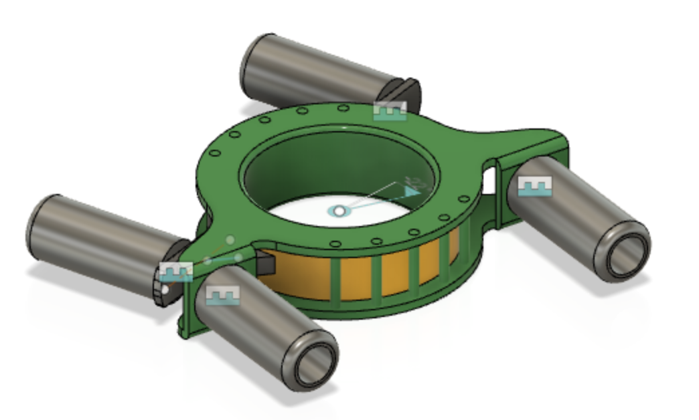

# 112 - Central hub

>

The central hub connects the four beams together. It is crucial for structural integrity of the vehicle frame, yet should be kept as light as responsible.

We (Asko) tried to find existing parts to do this job, but it seems a dedicated design is needed.

The hub connects to the beams with inset pipes (suggestion). Such pipes must be long enough to provide good rigidity with the beams. The ends of the pipes should be rounded, to not cause spiky forces to the beams. (Other designs may also be suggested for the attachment to the beams.)

The front and rear sides may move, at least ±22° from the alignment positiion. They are run by a motor (part of this design, though not in the picture).

The motor arrangement must be such that external forces (kickback) does not cause harm to the motor, nor cause steering (worm gear comes to mind).

The opening can be less than in the model (and the picture). It is intended for the cabin placement, and not crucial in MVP 0.1. However, some opening (min ⌀10cm) should remain.

## Design notes

The hub has two parts, inner and outer. They are co-centric and rotate againts each other.

### Motor attachment (not in the picture)

#### Worm gear implementation

The inner cylinder could have worm gears engraved on its surface. A motor driving such could be attached to the outer cylinder, horizontally.

#### Wire + leverage implementation

Another possibility is wires pulling one or the other end of the front beams, and the wire passing through one or more lever elements, to make the job of the motor easier.

>Something like shown in [this video](https://www.youtube.com/watch?v=utDagouxM5U) (Youtube, 2020, 11:23)

There is enough space for a relatively wide wheel for the wires. 

Compared to worm gear:

- 🟢 likely easier to avoid back-kicking (wire can be tightened)
- 🟢 easier to manufacture: no need to groove worm gears
- 🟠 takes more space
- 🟡 likely similar weights 
- ⚪️ may allow smaller motors to be used (to be evaluated)

## Concerns

*Add concerns here*

## Specs

Strength specs come from the #100 combined assembly requirements.

|Spec id||
|---|---|
|`OPENING`|must open ±22° from the alignment|
|`STEERING ACCURACY`|must be able to steer the opening angle to xxx deg|
|`STEERING RESISTANCE`|must be able to keep the steering angle, despite xxx N force pushing against it (may use electric power for doing so)|
|`ANGULAR CLEARANCE`|when supported at the beam ends|

## Requirement to other parts

|Towards part|Req id||
|---|---|---|
|`#600-000` - battery|`POWER NEED(xxx V, yyy Apeak)`|requires xxx Volts with xxx Amps (peak)|

## Open issues

- [ ] Design and positioning of the motor - as described above.

Next: [Front tray](./113-tray.md)
