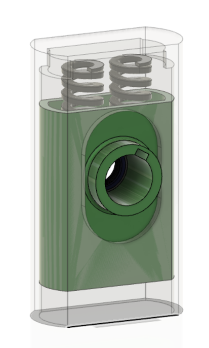

# 121 - Suspension

>

>

Suspension provides rotational stiffness but allows the weight of the vehicle to lie on the wheel axis, with suitable cushioning.

## Design notes

Asko first looked at off-the-shelf shock absorbers, but nothing seemed to quite work for this. Our wheels (their axis) are above the vehicle body, which is unusual. We don't have much of vertical height to play with, like bicycles and motorbikes do. Thus, a custom approach may be the best way.

The design has an outer cover, inner mover and some springs to take the load.

It is enough to attach the springs only to one part (i.e. the mover). Once the wheel is attached, the mover won't be able to fall out, even if the wheel was unsupported.

We don't know yet, whether the front suspension will be visible, outside of the cabin. If they were, they need to look great and the wiring would likely be routed insider the cover. For now, it's enough to have a hole where the wiring can come out. Weather protection is not needed for MVP 0.1.

The outcome of MVP 0.1 iterations should be a suspension that "just works" for MVP 0.2.
 

## Design options

Many options.

The important thing is simply to attach the wheels to the body, one way or the other. To learn and then iterate.

## Concerns

*Add concerns here*

## Open issues

### `#121-008`

There is a flaw in the model used for the pictures: The collar around the wheel axis cannot be part of the mover, or something else must give. Here are some ways to solve this:

- make cover out of two parts (nah..)
- make mover out of two parts (maybe..)
- have the collar as a separate piece that just fills the gap between suspension and wheel, but does not provide support
- have the collar as a pipe that is placed after mover (but which does provide support)

The last plan sounds meaningful, and the model should be updated accordingly, unless someone has an argument against it. This would allow fast pulling of the suspension apart (e.g. for inspection).

Note: Such pipe must have grooves so that it firmly attaches to the mover and doesn't spin with the motor.

## Specs

No clear specs, at this time. "Make it strong enough" and "keep it light".

---

The `#122` "Connection to beam" are skipped, since they are manually made ad-hoc parts or arrangements. If they were to be needed for real (after MVP 0.1), we'll add models and a page.

---

Next: [Control Unit](./140-control.md)
