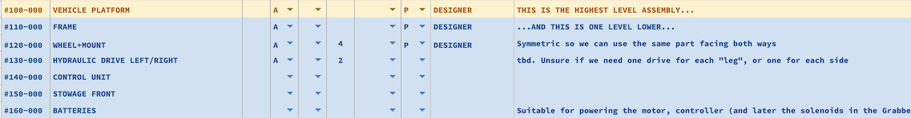

# Vehicle platform

In the PBS, the Vehicle has id's #100..#199.

>

## MVP version 0.1

Provides us with a platform that can move front/back, steer, lift its "feet" but does not allow track-captive transportation only on one side of wheels. 

Learning exercise, gets our collaborative side going.

- [110 Frame](110.md)
- [120 Wheel+mount](120.md)
- [130 Hydraulic drive](130.md)
- [140 Control unit](140.md)
- [150 Stowage](150.md)
- [160 Batteries](160.md)

## MVP version 0.2

Adds track-captivity to the mix, allowing junctions to be taken and one-sided track sections to be traversed.

- [180 Grabber arms](180.md)
- [190 Support ribs](190.md)
- [1A0 Remote controlling equipment](1A0.md)

At this stage, a public demonstration could be performed.

Next: [Frame](../110.md)

