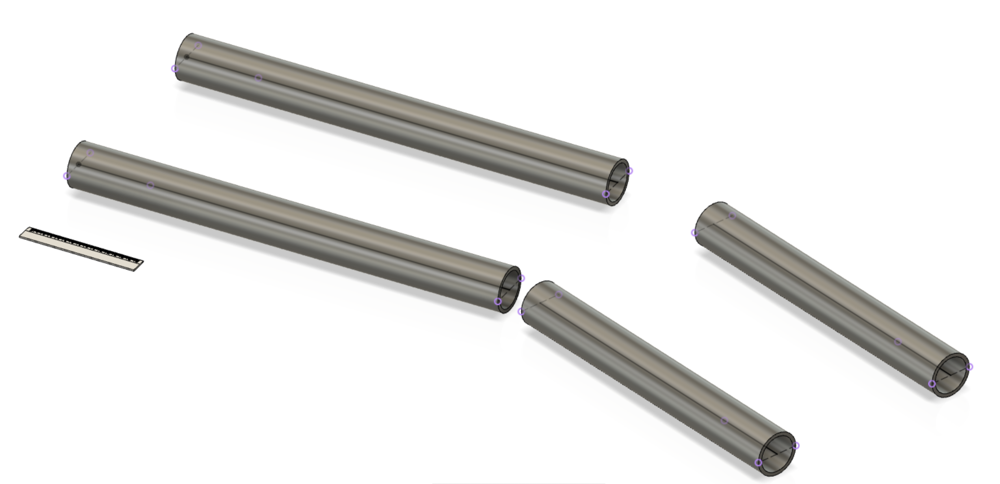

# Sledge Frame (XXX)

>

*xxx Bars. The ruler is 15cm long, for scale.*

Sledge frame is what keeps the pieces together - and connects forces from the cabin to the track.
 
It needs to:

- withstand heavy forces (to be defined later)
- allow tight curves (not in full speed), down to 3m radius

**Design decisions**

The wheels are to be placed in between the bars. In the whole design the difference in weight point whether one rides on the left wheels or the right ones, must be small. This is easiest gained if the structural bars are out of the way.

Also, for movement in the cabin it's likely useful that the supports are not very tight together in the center, but spread out. On the other hand, we don't want to bring them too far. The intention is that the support frame can hide underneath a more or less circular chassis, blending into it and being unobserved.

Pipes being hollow allows cabling to be carried through, within them.

**Testability**

There's not much we can test with just the bars. Bendability is the most crucial thing, and not getting cracks at openings, once we have some (not in the picture).

It likely makes sense to perform the tests at the module level (with wheels, connecting rods, and the central hub. The central hub is crucial for distribution of the strengths.

**Modeling details**

<!-- disabled

How the master sketch is laid out.

-->

