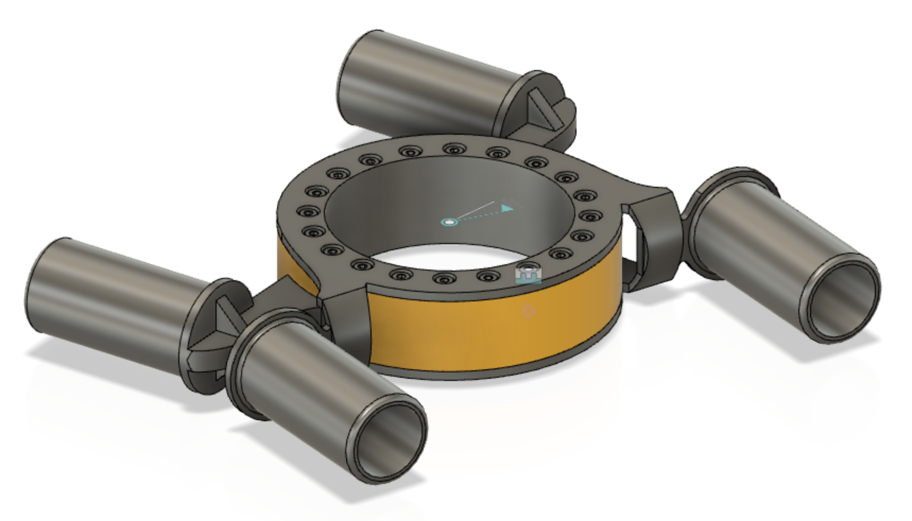
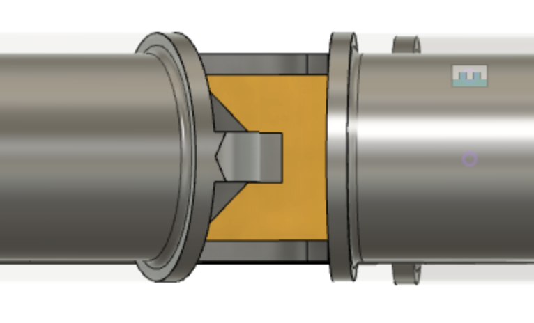

# 112 - Central hub

>

The central hub connects the four beams together, in the middle. It is crucial for structural integrity of the vehicle frame, yet should be kept as light as responsible.

The hub has two parts, inner and outer. They are co-centric and rotate againts each other. Rotational speed is relatively low, range at most 
±22° from straight alignment between the beams[^1]. 

Asko tried to find existing parts to do this job, but it seems a dedicated design is needed.

[^1]: This relates to a 3m minimum turning radius, and is dependent on the distance from the hub to the wheels. 

The circular opening in the middle can be smaller than pictured. It is intended for the cabin interface, and not crucial in MVP 0.1.

## Design notes

### Attachment to beams

The hub connects to the beams with inset pipes (suggestion). Such pipes must be long enough to provide good rigidity with the beams. The ends of the pipes should be rounded, to not cause spiky forces to the beams. (Other designs may also be suggested for the attachment to the beams.)

### Assembly

The rear part is intended to be manufactured in two pieces, allowing the whole to be assembled like a sandwich, leaving the front cylinder (yellow) in between the rear halves.

>This halfing is not in the model, or in the picture. It is not decided, whether the beam attachments should be connected to both halves (likely better) or just one.

### Avoiding vertical backlash

This is one of the important structural jobs of the part. The rest of the design (see `#190` Ribs MVP 0.2) tries to avoid loading the hub with downward pointing force, but of course there will be some.

The form of the front and rear cylinders should help in this. We don't want to grow the cylinders too high or thick, but we can have the front cylinder have overhangs (in front and back) that take support of the rear piece (using horizontal dimension for added support).

These are not in the picture, but keep in mind. Allows us to make flatter donut with more structural integrity. Note: We can also have them only in one side (back), keeping the overall space envelope of the part small. 🙌

### Rotating force

The motor rotating the hub is not in the picture. There are multiple techniques that could be used:

- worm gear; gear directly attached to the yellow cylinder (front)
- winch; wires pulling the yellow cylinder left/right
- hydraulics

The motor arrangement must be such that external forces (kickback) does not cause harm to the motor, nor cause steering (worm gear comes to mind).

Naturally frictions need to be reduced, in order to keep the motor relatively sized.

#### 1. Worm gear implementation

The inner cylinder could have worm gears attached on its surface. A motor driving such could be attached to the outer cylinder, horizontally.

To get best grip, a [globoid kind of worm gear](https://www.youtube.com/watch?v=OVTOSOKpx6I) (Youtube) might be best (longest touch between the gears).

Pros / cons:

- 🟢 simple (once the gear is modeled) and mechanic: no stretching parts or liquids
- 🟢 great kickback prevention
- 🟡 cannot be made to disappear into the beams (= takes space)

This is likely the way to go. The gears and the motor can be enclosed in the rear piece, making them an internal part of the design.

#### 2. Winch implementation

Another possibility is wires pulling the cylinder in one or the other direction. If such wires follow the curvature of the cylinder, their total length remains constant, regardless of the turn angle.

>Note: Wires often allow for leverage, but with using the cylinder this is challenging (uses up the vertical space of the cylinder). At most 2x leverage is possible (3 + 3 wires). See [this video](https://www.youtube.com/watch?v=utDagouxM5U) (Youtube, 2020, 11:23) on leverage with wires.

The wires can be attached to the "ears" of the front piece, perhaps with a mechanism that allows them to be tightened in place.

Winch can be made either with one continuous wire or two separate ones (and two separate motors).

Compared to worm gear:

- 🟢 easier to manufacture (if not 3D-printing the gears)
- 🟡 which one takes more space?
- 🟡 likely similar weights 

Winch remains a plan B. The good part is that the cylinders can be designed to facilitate either one, so we can experiment. Part of MVP 0.1 outcome must be knowledge on how to steer this thing properly and robustly.

### Rotation sensor

Either via the motor, or with an external sensor, we must be able to tell the angle between front and end beams, whether steered by the motor or by outside forces.

>Q: [ ] How to measure such an angle?

Just placing Gray coding strips on one half and a detector on the other would do this. 

>Benefit of not needing the motor to have position awareness is larger range of motors to select from. Then again, the motor needs to be good at keeping its current position.

### Dimensions

>

The hub may extend past the *top* of the beams, but not below them.

It is preferable if also the top can be kept at the level of the beams' top, but this is providing the cabin interface (see Requirements to other parts).

## Passive return to alignment (considered)

It could be nice for resiliency that in the case of motor damage, a straight alignment would happen naturally.

This could be done e.g. by adding springs between the front/end sides of the hub, pushing for a balanced situation.

However, this contradicts our aim to have high tolerange for kickback. Outside forces (of the motor) should not be able to decide the angle. If we want springs, we much specify how much they are allowed to push back. For winch this wouldn't be a problem. For worm gear it likely is.

So no springs, at least for now.

## Concerns

*Add concerns here*

## Specs

Strength specs come from the #100 combined assembly requirements.

|Spec id||
|---|---|
|`STEERING RANGE`|must open ±22° from the alignment|
|`STEERING ACCURACY`|must be able to steer the angle by xxx deg|
|`STEERING RESISTANCE`|must be able to keep the steering angle, despite xxx N force pushing against it (may use electric power for doing so)|
|`NOT BELOW BEAMS`|the hub shall not extend below the lowest point of the beams(*)|

(*) Wheel + suspension design is in charge of enough clearance between the track and the beams. We don't want overhangs that would change this.

## Requirement to other parts

|Towards part|Req id||
|---|---|---|
|`#600` - battery|`POWER NEED(xxx V, yyy Apeak)`|requires xxx Volts with xxx Amps (peak)|
|`#300` - cabin|`CABIN INTERFACE OPENING(xxx mm)`|how wide is the opening|
|`#300` - cabin|`CABIN INTERFACE DEPTH(xxx mm)`|how deep is the opening (cabin will have clamps through it)|
|`#300` - cabin|`CABIN INTERFACE SMOOTH BELOW(xxx mm)`|how wide outside the bottom opening is flat (mm from edge)|
|`#300` - cabin|`CABIN WEIGHT ON HUB (xxx kg)`|how much of the cabin's weight is allowed to rest on the central hub|

## Open issues

- [ ] Estimating the friction involved (force needed for the motor)
  - [ ] → Suitable motor selection
    - [ ] → Model the motor to Fusion 360

