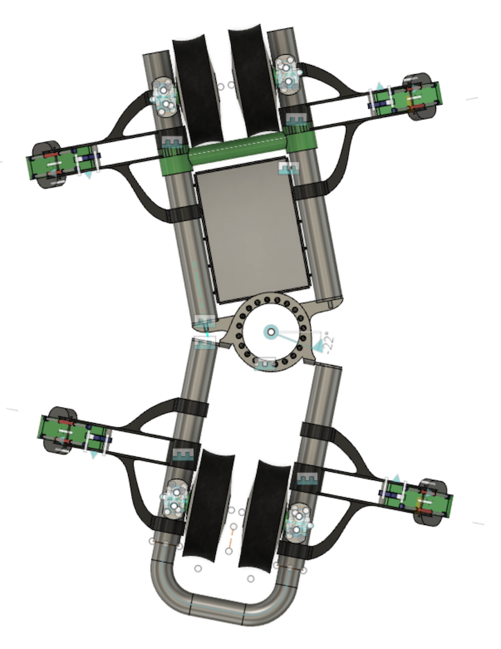

# 180 - Grabber arm

The grabber arm is essential for the vehicle's operations and passenger safety.

*tbd. full picture of the grabber arm, including claw*

## Design

>

*Figure 1. Track cross section (right handed)*

The vehicle's mass rests mostly on the main rail (or rails; at junctions there are two of those), but in order for it to stay safely on that rail, a secondary, slender support rail is needed.

This design allows the track construction to be simple (tubular rails), formable on-site and light for passers-by. 

Grabber arms are (alongside wheels) the interface of the vehicle with the track. The feasibility of the **whole** design depends on getting the grabber arms right.

The arms need to be robust, reliable and provide minimal friction in the direction of the track. They are like switchable linear bearings.

In track junctions, the grabber arms must perform flawlessly in any weather conditions, for at least a million switches. A failure to do so would cause emergency stops and halt that section's traffic for a while.

Operation must be both swift but also comfortable for the passengers. No hard noices, no unnecessary jolts in the movement and balance of the vehicle.

These requirements are plenty and often contradicting (eg. lightness vs. robustness), so any working solution will be a compromise.

## Context

The vehicle has four individual grabber arms, two on each side. These are located close to the wheel axes, for better stability and reliable distance between the main and support rails.[^1]

[^1]: Also when the track is curved.

>

*Figure 2. Vehicle from above*

Parts having to do with captivity to the track must work individually for each arm (redundancy), but non-captivity specific parts (eg. opening and closing the claws) may use common mechanics (eg. pneumatics).

## MVP 0.2

Some of the requirements involve the claw component (#181). Some are a collaboration of both the claw and the arm.

**Track captivity:**

- [ ] Be able to grab the support rail, regardless of its relative "wobbly" position with the main rail [ARM,CLAW]

   We can help the claw do this by having an extension mechanism in the arm. It's a collaboration.
- [ ] Provide a locking mechanism that remains locked in the absence of outside control. [CLAW]
- [ ] Be able to tell, whether a grab is successful or not. [CLAW]

   Note: This must be real-time throughout the ride. It must detect eg. sudden lack of support rail (which essentially means broken track).
   
**Snappy grab:**

- [ ] Less than 1,5s from "prepared" to "grabbed" (timeout is considered a failed grab) [CLAW]
- [ ] Less than 1,5s from "grabbed" to "opened" (timeout is considered a failed ungrab) [CLAW]

>*Maybe these times can be improved a lot. Needs to be tested with actual prototypes.*

**Pull-back**

- [ ] The arm should be able to pull back the claw (from "prepared" position) so that it's within the enclosure of the vehicle.

   This is mostly an esthetic requirement, but an important one. Being able to hide the support arms (when not used) accounts for the impression that the vehicle is running on a single rail.
   
   This movement is not time critical.

**Movement restrictions:**

- [ ] Must never, ever, reach the "forbidden zone" (area used by the rods connecting track and support rail). This should be made mechanically impossible. [ARM,CLAW]
- [ ] Must be able to lift the claw above the main track's top + margin. 
Needed when switching tracks.

**Smoothness of travel:**

- [ ] Provide passive and active suspension. [ARM, CLAW]

   The claw provides passive suspension. The arm provides active (length and angle control) in addition to that. These are measurable quantities, eventually. With a certain wobble of the support rail vs. main rail, will wobble of the vehicle remain within a provided range.
- [ ] When grabbing/ungrabbing, the impact caused to the (empty) vehicle, while track captive on the other side, must not exceed X mm/s². [CLAW]

   Most of the burden on this falls on the claw. Arm won't be able to help in grabbing, because it needs to control the position of the claw precisely.

## Requirements to/from other parts

|Towards part|Req id|
|---|---|
|#110 Frame|Position for attaching|

|From part|Req id|
|---|---|---|

|With part|Req id|
|---|---|---|
|#800 Track|The measures of the support rail can be negotiated.|
|#800 Track|The relative position with the main rail can be negotiated.|
|#800 Track|The dynamic "wobble" of the support rail from main rail can be negotiated.|

