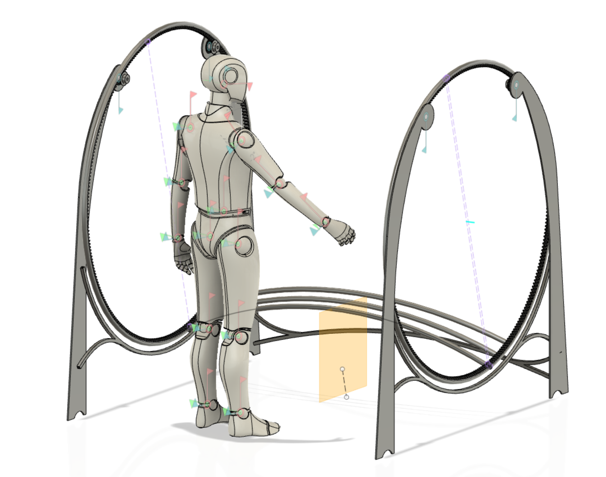

# #500 - Barrel pit-stop

## MVP version 0.1

Provides a table to study and test the vehicle platform (#100) on.

>

**Design goals:**

- easy to assemble and dis-assemble
- compact for transport (when in pieces)
- working level ergonomically suitable for an average person
- openings big enough for the vehicle platform to drive in (without a cabin)

We can make this all mechanic, no electricity or software needed. So let's do so! :)

In style with that, and slightly by accident, the CAD design started to remind of cast iron machinery and decorative designs, in lat 1800's. It would be awesome to be able to keep that feel to the actual product. 🎩

**Implementation:**

The 510..530 parts are not derived from the vehicle configuration. It's only 540 (track) that brings the vehicle in the picture.

This simplifies CAD work.

**Purpose:**

Learning platform.

- [510 Pedestal](./510-pedestal.md)
- [520 Wheels](./520-wheels.md)
- [530 Crank](./530-crank.md)
- [540 Tracks](./540-tracks.md)

## MVP version 0.2

More structural robustness, based on experience of MVP 0.1. Enough that a vehicle can be placed safely on either of the tracks, and track-captivity tests be done in different angles.

These features of track (#540) become useful only with with an MVP 0.2 vehicle platform:

- side rails for testing track-captivity
- lowering the front track for testing track-captivity
- testing lifting of wheels

**Purpose:**

Supporting reaching the goals of vehicle platform MVP 0.2:

>Proving that the vehicle stays on track and can take junctions.
