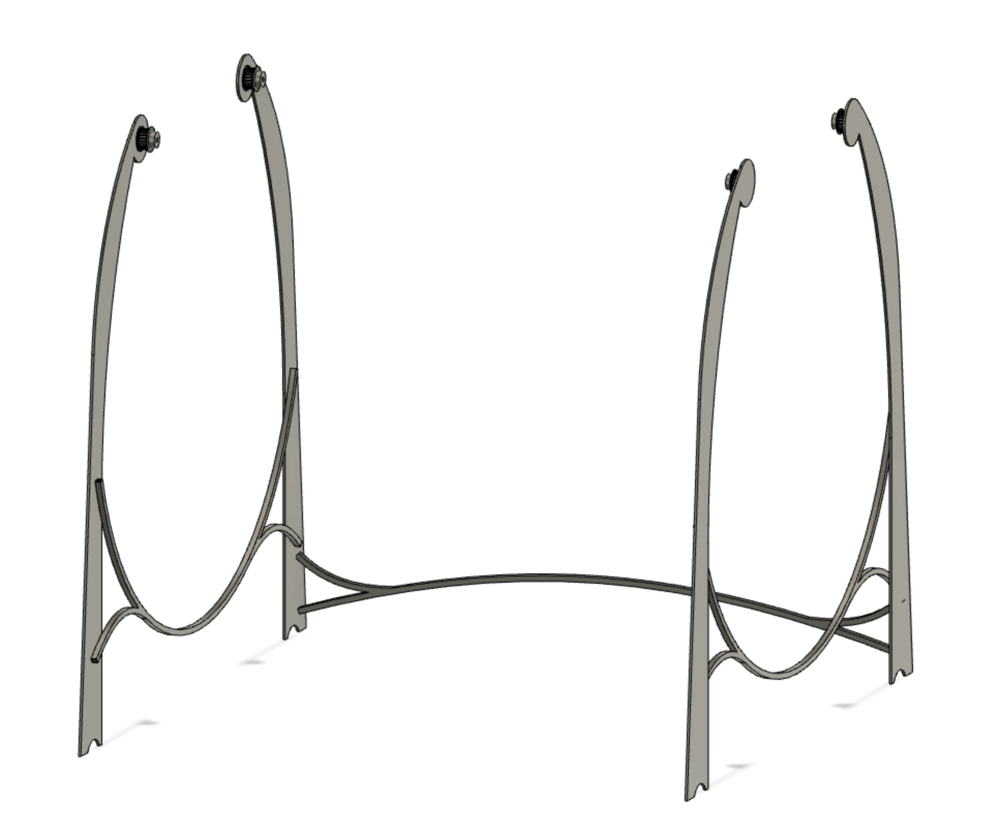

# 510 - Pedestal

<!--

-->

>

Purpose:

- provides structural firmness to the whole Barrel pit-stop

## Design

By supporting the wheels from above, instead of from below, gravity works to our advantage and should help stabilize the construct.

More rollers / supports can of course be added, to make the construct rigid and safe to operate.

However, rods high up will have a visually disturbing effect. We're getting a rotating table in the middle and it would be best if it feels that table simply rotates in air.

The wheels themselves will be providing a pushing support between the left and right stands. It is enough, in MVP 0.1, to have enough rigidity for the setup to stand straight, when assembled.

Since the wheels will grind directly to the stands (by design, to provide support), maybe some anti-friction coating is needed. This can be applied only to the areas needed (behind the wheels), thus not being seen.

## Assembly

The parts are to be connected with bolts, hidden enough that they don't   obstruct the cast iron feeling of the design.

## Interfaces

- Wheels hang from the rollers at the top
- Crank attaches either to the left or the right stands, depending on the preference of the operator

## Open issues

- [ ] Selection of roller (stock part)
  - [ ] Teething of the roller/wheel (together with Wheel #520-001)

## Concerns

- Structural rigidity to be seen when manufacturing (could also be simulated)
- Rollers likely need plates attached to them, to avoid the wheels from falling off

*Add concerns here*

## Specs

|Spec id|value|comment|
|---|---|---|
|`OPENING WIDTH`|1.4 m|width of the vehicle platform that must be able to "drive in"|
|`PAYLOAD WEIGHT`|100 kg|max weight of: vehicle platform, wheels, tracks, needed to be supported by the pedestal and its rollers|

## Test cases

later

## Parts

- 511 - Pedestal half (left/right)
- 512 - Back support

