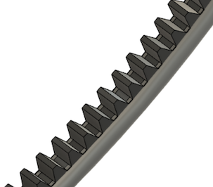
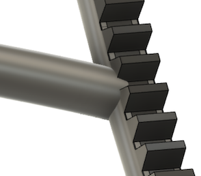

# 520 - Wheels

>

Purpose:

- provides a turning barrel
- provides support to the track sections

## Design

The both ends are connected, but only from a narrow angular section. This allows the barrel to be mostly unnoticed, not obstructing the work.

The barrel rests on rollers (#511-004) and can be rotated by a crank (#530) from either end, wide but not full circle (arcs don't get past the support rollers).

The teeth can be made as a belt, attached to the wheel:

>

The attaching of the arcs must be such that it does not obstruct use of the teeth, not possible supports (optional) placed in the lower part of the pedestal.

>

*(In the picture the arc proceeds a bit too much to the teeth belt.)*

## Requirements

- With tracks and a vehicle platform on it, the wheels can be rotated from either end.

## Options

### Horizontal axis to distributed rotational force

If the mechanical connection by the arcs (#520-002) is not strong enough between the ends, the wheels need to be connected, via gears.

Such gears, and the axis, should travel at the back of the Pedestal, near the floor (where current static supports are). This is most out of sight.

The gears must come out "outwards", not to obstruct the wheel arcs' travel. This is doable. Some chain, then axis outside of the reach of the wheels themselves.

<!--
tbd. Make a rough sketch on top of CAD picture if needed
-->

### Teeth can also be engraved

This is seen as a secondary option. A stock belt must be easier to come by.

### More support arcs

Having an arc on the opposite side of the ones in the picture is possible, as long as it would not overly obstruct the work. This may be necessary for structural stiffness (the wheels are intended to be helping the pedestal be stiff).

There are the things to evaluate within MVP 0.1 so we get a good, functional Barrel pit-stop for MVP 0.2 - when it's really needed!

## Implementation

The arcs are intended to be identical, to reduce number of parts.

The connection of arcs to the wheels (by screws) is such that it does not obstruct the crank wheel. It can (and must) be obstructed by the Pedestal's support rollers.

## Specs

|Spec id|value|comment|
|---|---|---|
|`ROTATION RANGE`|-X..+Y °|rotation of the wheels. Not a full 360°.|

## Concerns

   

 