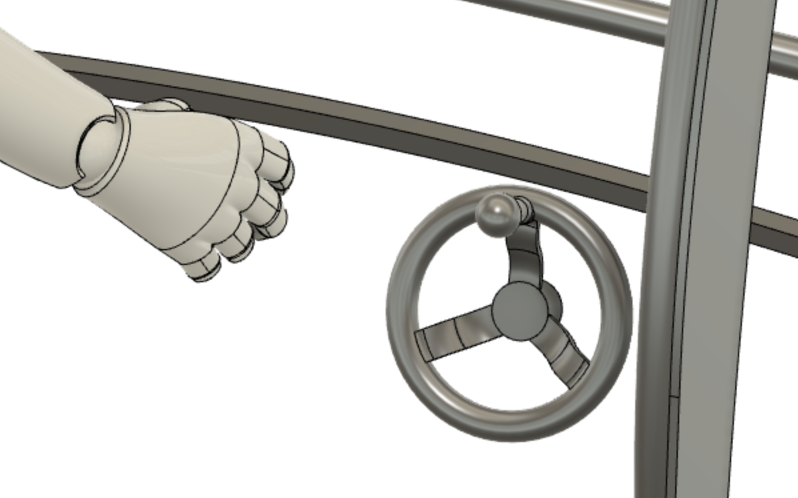

# 530 - Crank and pedal

>

Purpose:

- drive the barrel (clock / counter-clockwise)
- release rotation of the barrel (pedal; not shown)

## Design

The crank & pedal pair can be attached either to the left or the right side of the pedestal. Crank is used to drive the rotation. Pedal is needed to be pushed (by the leg) to allow rotation.

While we design a manually operated set here, it's possible to do this motorized, later on. The interface to the rest of the parts would remain unchanged.

>Note: Nothing much is done on this design, yet.

The crank is likely to end up on the outer side of the wheel (*not as it is in the picture*) - otherwise it obstructs the wheel arcs from moving past it.

## Options

## Implementation

## Specs

|Spec id|value|comment|
|---|---|---|
|`GEAR RATIO`|X:1|ratio that allows the crank to be light enough to handle, yet rotate the wheel (with 100kg on it!) in meaningful time|

Since this table is intended for product testing and exploration, speed of turning the wheel is not a priority. Just not a full year of waiting.

## Concerns

   

 